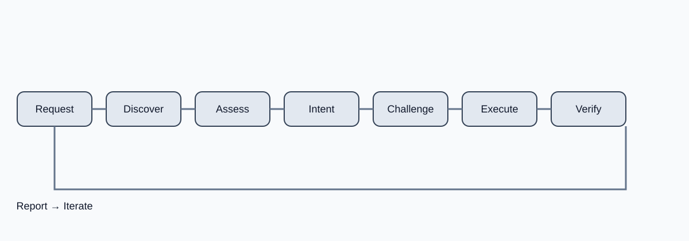

# The-Builder

> **A capability-aware, user-driven skill system for AI coding agents.**

The-Builder is a portable library of procedural skills for coding agents. It teaches an agent a complete working loop:

**discover → assess capability → understand intent → challenge material problems → plan → execute → verify → report → iterate**

It is deliberately **agent-agnostic**. The canonical methodology lives in `skills/`; provider-specific installation and host behavior lives in `adapters/`.



## Why The-Builder exists

A coding agent can have terminal access, a large context window, and still fail a task because it:

- asks the user for facts it could inspect;
- silently invents requirements;
- treats a subjective preference as a technical error;
- claims visual or runtime verification it could not perform;
- changes too much before validating an intermediate result;
- optimizes for its preferred stack rather than the user's goal;
- reports "done" without evidence.

The-Builder turns those failure modes into explicit behavioral contracts.

## Design principles

1. **Discover before asking.** Inspect the repository, environment, and available tools first.
2. **Ask only when the answer matters.** Questions should resolve a decision that cannot be discovered or safely defaulted.
3. **Understand intent.** Distinguish the literal request from the desired outcome, constraints, and preferences.
4. **Challenge substantive problems.** Surface security, accessibility, performance, maintainability, feasibility, or requirement conflicts when there is concrete evidence.
5. **Respect user authority.** Recommendations are not overrides.
6. **Be capability-aware.** Never claim an action, observation, or verification that the current agent cannot perform.
7. **Execute incrementally.** Prefer bounded changes with checkpoints over uncontrolled rewrites.
8. **Verify outcomes.** Verification is part of the task, not a decorative final step.
9. **Report evidence and limits.** State what changed, what was tested, and what could not be verified.
10. **Degrade gracefully.** When an ideal capability is unavailable, choose a safe lower-fidelity workflow or stop rather than pretending.

## Repository layout

```text
The-Builder/
├── skills/                  # Canonical installable skills
│   ├── project-discovery/
│   ├── capability-assessment/
│   ├── interaction/
│   ├── challenge/
│   ├── execution/
│   ├── verification/
│   ├── reporting/
│   ├── ui-ux-design/
│   ├── animation-design/
│   ├── 3d-web-design/
│   ├── scroll-world-flyby/
│   ├── content-code-optimization/
│   ├── seo/
│   ├── security/
│   └── reviewer/
├── core/                    # Specifications, orchestration contracts, registries
├── adapters/                # Host-specific metadata and installation guidance
├── integrations/             # Tool/plugin/connector contracts
├── cli/                     # Local repository utility CLI
├── docs/                    # Specifications and design documentation
├── tests/                   # Structural and behavioral contract tests
├── assets/                  # Architecture/workflow diagrams
└── scripts/                 # Dependency-light validation/test suite
```

## Canonical skills

### Foundation

| Skill | Role |
|---|---|
| `project-discovery` | Establish facts about the project before planning or changing it. |
| `capability-assessment` | Determine which model, agent, tool, environment, and project capabilities are usable. |
| `interaction` | Resolve only decision-relevant unknowns and preserve user authority. |
| `challenge` | Surface material problems with evidence and alternatives. |
| `execution` | Turn an approved plan into bounded, reversible implementation steps. |
| `verification` | Match verification depth to the risk and claimed outcome. |
| `reporting` | Report changes, evidence, limitations, and remaining work accurately. |

### Domain

| Skill | Role |
|---|---|
| `ui-ux-design` | Design usable, accessible, responsive interfaces from intent and evidence. |
| `animation-design` | Design purposeful motion with timing, state, accessibility, and performance constraints. |
| `3d-web-design` | Design interactive 3D/web experiences with camera, scene, asset, and performance discipline. |
| `scroll-world-flyby` | Build spatial scroll/fly-by experiences as one continuous scene-navigation discipline. |
| `content-code-optimization` | Improve content quality and code efficiency without optimizing one at the expense of the other. |
| `seo` | Improve crawlability, information architecture, metadata, structured data, and measurable search performance. |
| `security` | Identify and remediate application security risks using evidence, threat modeling, and least privilege. |
| `reviewer` | Conduct structured multi-dimensional reviews with severity, evidence, impact, and actionable recommendations. |

## Installation

The recommended distribution is the npm CLI. No clone is required.

```bash
npx @wasif-qamar/the-builder
```

The wizard detects the current OS/runtime and supported coding-agent executables, then asks whether to install **for the current project** or **globally for the current user**. It can install all canonical skills or a selected subset.

Non-interactive forms are available for automation:

```bash
npx @wasif-qamar/the-builder install --project --all
npx @wasif-qamar/the-builder install --global --all
npx @wasif-qamar/the-builder detect
npx @wasif-qamar/the-builder doctor
```

Project installation creates `.the-builder/skills/` and an installation manifest in the current project. Global installation creates `~/.the-builder/skills/` and a global manifest. Existing host configuration is not guessed or overwritten: detected agents are recorded so the appropriate adapter can be applied explicitly when a host requires provider-specific discovery/configuration.

The canonical installable unit remains `skills/<name>/SKILL.md`. Adapters describe host-specific conventions; they do not duplicate the canonical methodology.

## Native agent installation

When a supported agent is detected, the installer copies the canonical skills into that agent's documented skill directory. The CLI never assumes a host-specific path when this repository cannot substantiate it.

| Agent | Project | Global | Status |
|---|---|---|---|
| Claude Code | `.claude/skills/` | `~/.claude/skills/` | documented |
| OpenCode | `.opencode/skills/` | `~/.config/opencode/skills/` | documented |
| Kiro | `.kiro/skills/` | `~/.kiro/skills/` | documented |
| Cursor | `.cursor/skills/` | `~/.cursor/skills/` | documented |
| Codex | `.agents/skills/` | `~/.agents/skills/` | documented |
| Gemini CLI | `.gemini/skills/` | `~/.gemini/skills/` | documented |
| GitHub Copilot CLI | `.github/skills/` | `~/.copilot/skills/` | documented |
| Cline | `.cline/skills/` | `~/.cline/skills/` | documented |
| Generic / other | `.agents/skills/` | `~/.agents/skills/` | portable fallback |

Roo, OpenHands, and Antigravity remain conservative adapters until a native `SKILL.md` discovery location is substantiated in this repository. They use the portable `.agents/skills/` fallback rather than an invented provider path.

## Local validation

Requirements: Python 3.9+ and Node.js 18+.

```bash
python3 scripts/validate.py
python3 scripts/test_suite.py
npm run validate
npm test
node cli/bin/the-builder.js list
node cli/bin/the-builder.js doctor
```

The validator checks front matter, required behavioral sections, Markdown fences, skill naming, duplicate/conflicting skill directories, adapter contracts, integration manifests, links, and repository invariants. The test suite checks behavioral/contract fixtures and CLI smoke behavior.

## Skill structure

Every canonical skill uses:

```text
skills/<name>/
└── SKILL.md
```

The required behavioral contract is:

```text
Purpose
Core Principle
Scope
Discovery
Capability Requirements
Interaction
Challenge Handling
Execution Workflow
Verification
Reporting
Completion Criteria
```

Domain skills may add specialized sections, but they must not redefine those responsibilities inconsistently.

## Skills versus integrations

**Skills are methodology.** They describe how an agent should reason and work.

**Integrations are capability contracts.** They describe what an external tool, plugin, connector, or runtime may provide.

A skill may require browser access for visual verification, for example, but the integration layer does not magically grant that capability. Capability assessment must inspect what is actually available.

## Adapters

Adapters are intentionally thin. They translate canonical skills into host-specific installation or discovery conventions. They are not alternate copies of the skills.

Supported adapter metadata currently covers:

`generic` · `opencode` · `claude-code` · `kiro` · `cursor` · `codex` · `gemini` · `github-copilot` · `antigravity` · `cline` · `roo` · `openhands`

Provider claims are marked as verified only when this repository has a reproducible test or authoritative source for the claim.

## Quality and contribution

Read `CONTRIBUTING.md` before adding a skill. New skills should solve a repeatable workflow problem, include evidence-oriented verification, avoid provider lock-in, and include behavioral cases.

See:

- `docs/spec/SKILL-SPEC.md`
- `docs/adapters/ADAPTER-SPEC.md`
- `tests/README.md`

## License

MIT. See `LICENSE`.
